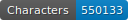

# FONDUE-FR-PRINT-17

   

This repo contains the transcription of 17th c. prints.

## Content

- Nicolas Boileau, _Oeuvres diverses du sieur D*** , avec le Traité du sublime ou du merveilleux dans le discours, traduit du grec de Longin_, Paris : D. Thierry, 1674 [lien gallica](https://catalogue.bnf.fr/ark:/12148/cb301204331)

## Licence
